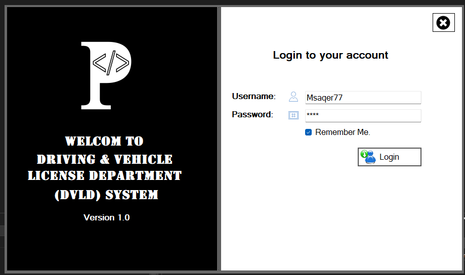
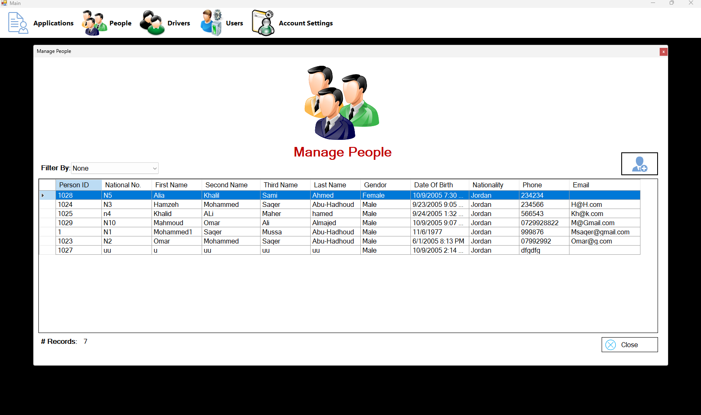
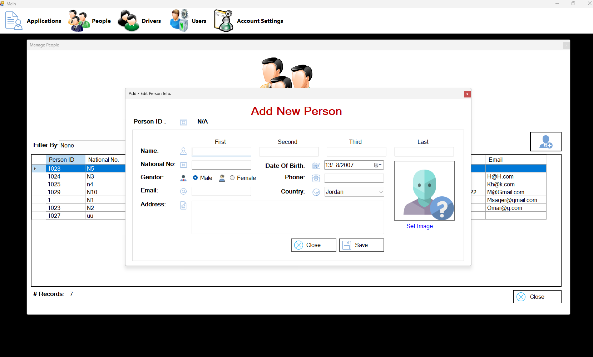
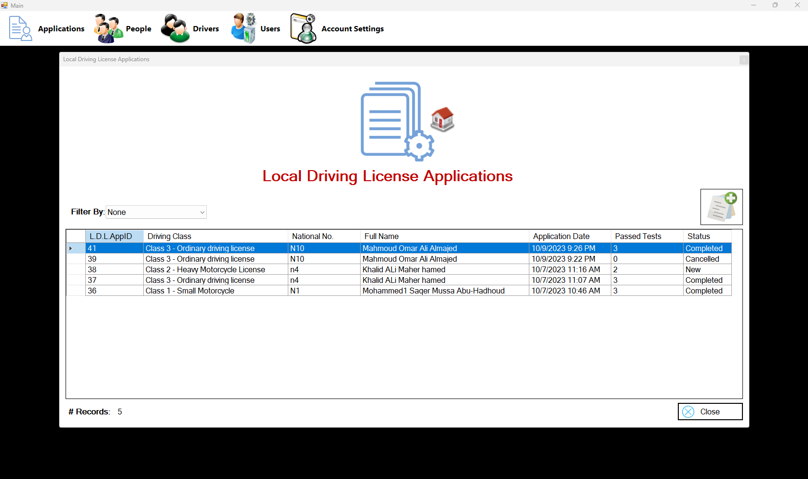
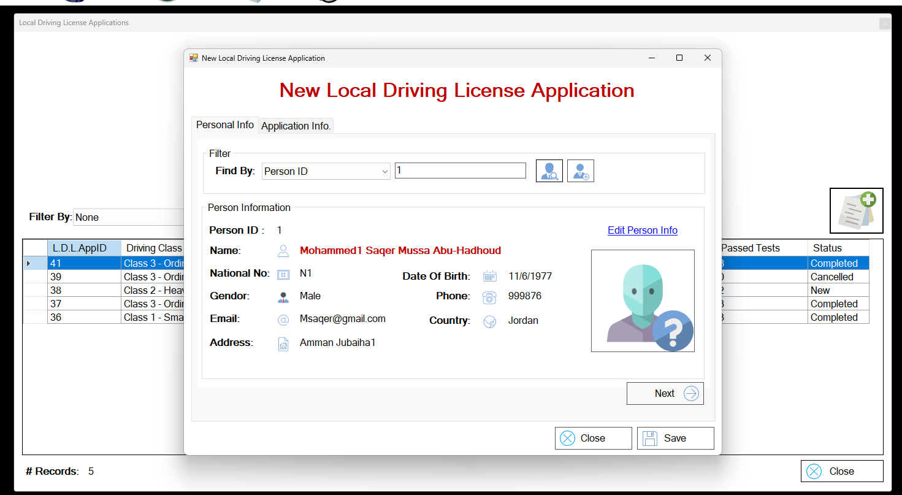
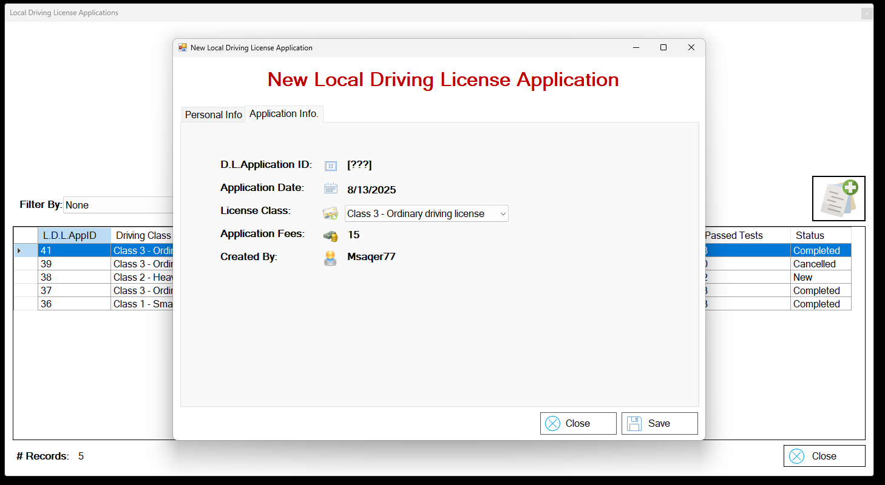
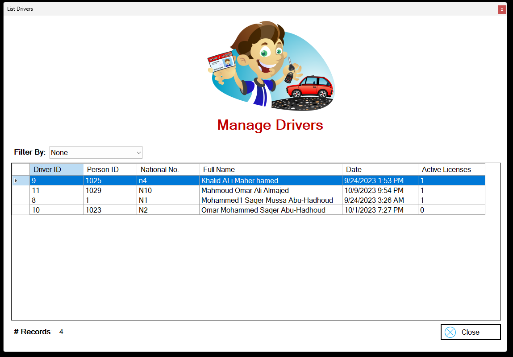

# Driving & Vehicle License Department (DVLD) Management System

A comprehensive management system designed for the **Driving & Vehicle License Department** to handle all operations related to issuing, renewing, replacing, suspending, and reinstating driving and vehicle licenses.  
It ensures that all processes are efficiently managed and that applicants meet the required standards.

---

## 🚀 Key Features

- **People Management:** Add, edit, delete, and search individuals applying for driving licenses.
- **Application Management:** Handle local and international driving license applications with detailed statuses (New, Completed, Cancelled, etc.).
- **License Processing:** Manage the issuance, renewal, and replacement of licenses.
- **Driver Management:** Store and update driver information.
- **User Management:** Manage system administrators and roles.

---

## 🛠 Technical Details

- **Language:** C#
- **Framework:** .NET Framework (WinForms)
- **Database:** SQL Server
- **Architecture:** Three-tier architecture for clean code and maintainability.

---

### 📝 Note  
This project is part of the **19 - Full Real Project by Programming Advices (Mohamed AbouHadhood)**.

## 📸 Screenshots

